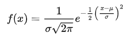
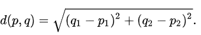
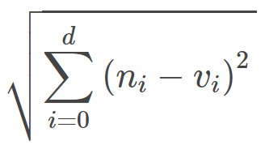

# Developer Document

## Getting Start:

### Hardware Requirements

make sure there is CPU virtualization supported, both Windows or Linux server working for docker, suggest greater than 30G storage as a minimum since the database server included in one server, for expanding just separate the database server to a different container then config the connection configuration under Django setting.

### **Step 1: Install docker**

Following Docker doc for initializing docker environment:



### **Step 2: Prepare Docker File and Project**

Git Clone the Project:

```
$ git clone https://github.com/qq1499412503/SOM.git
```

###  **Step 3: Building Docker Image**

Once Project prepared, starting building the image:

```
sudo docker build -t som:v1 .
```

### **Step 4: Run Docker container**

After Image built, run the following command to start the docker container:

```bash
sudo docker run -d -p 20:22 8080:8080 80:80 som:v1 /usr/sbin/sshd -D
```


 Port number issued here, allowed to config custom


### **Step 5: Visit Web Page**

Since Docker Server initialized, now you can access the system by the web browser.

## Technology: Self-Organizing Map

### Initialization

_x and y_

x and y defined for row and column of neuron nodes

_weights matrix_

based on defined x and y, the weights matrix initialized by the random value of shape \(x, y, length of data\)

_neighborhood function_

the neighbor function used weights the neighborhood of a position in the map, such as Gaussian distribution



_decay function_

the decay function used to update the learning rates and sigma based on each iteration

$$
learning rate(t) = learning rate / ( 1 + t / max iterations /2 ) )
$$

_sigma_

the sigma refers to the spread of the neighbor

$$
sigma(t) = sigma / (1 + t/T)
$$

_learning rate_

learning rate used for updating the weights matrix

$$
learning rate(t) = learning rate / (1+t/T)
$$

_activation distance_

the function used for calculating the distance between nodes, such as euclidean



### Training

_Winner method_

the first step to finding the winner node based on initialized weights matrix to each data row



_update sigma and learning rate_

the second step since the decay function allocated, its sigma and learning rate updated by iteration number

_update gaussian matrix_

in the third step, the gaussian matrix updated by winner location, sigma and learning rate


_update weights matrix_

the weights matrix updated by input vector, weights vector of neuron i and neighborhood function

$$
weights(t+1) = weights_i(t) + neighbour matrix(input vector(t) - weights_i(t))
$$

_u-matrix_

the u-matrix calculate the distance\(such as euclidean\) of the target neuron node to the nodes around the target nodes under hexagonal topology

### Plotting

since the map data calculated, it should include the weights vector of each node\(following updating steps\), distance to neighbor nodes and label to neuron node\(calculated by winner method\), the color of the map now generating by distance map\(distance between nodes\) which is u-matrix

### Other Action

the other action taken involved the relation plotted after the map dragged.

_updating neighbor matrix_

as the x-axis being an example, since there are relation out of map range, the range for calculating neighbor matrix expand_s_ to 3 times \(range\_x \*3\)

_expands weights matrix_

as the neighbor matrix should be expanded, the weights matrix expands to 3 times\(3x3 to original matrix\) by copy the original matrix with the winner location updated

_update weights matrix_

since the weights matrix expanded, its neighbor matrix of each winner nodes been calculated and updated for new weights matrix\(pick central matrix as new weights matrix for updating\)

## Packages:

#### the packages in the project involved:


| Name | description |
| :---: | :--- |
| pandas | package for matrix calculation |
| djongo | package for django based database |
| MiniSom | package for self organized model |
| django | package for framework |
| djangorestframework | package for API implementation |
| matplotlib | package for graph calculation |
| bokeh | package for graph calculation |
| numpy | package for matrix calculation |
| D3 | package for drawing the map |
| ajax | package for API request |


## Method:



Home Url



Locate the pages of the system by default URL, where the user is Login, render project list page, if a user is not Login then render the login page








redirect to web page


```markup
/publish/list/
or
/user/login/
```







HTTP: Login



Render Login page








HTTP Response


```
/user/login/
```







HTTP: Login



Submit form data for Login






Email for login



User password







redirect to project list page where success or error message with login page


```
/publish/list/
or
/user/login/  -- {"code":"164" ,"msg": "username or password incorrect"}
```







HTTP: Register



Render register page








HTTP Response 


```
/user/register/
```







HTTP: Register



Submit form data for register






User name



Email



Password







Redirect to project list or render register page where there is an error


```
/publish/list/
or
/user/register/  -- 
{"code": "111", "msg": "username existed"}
{"code": "222", "msg": "username error or username existed"}
{"code": "333", "msg": "email existed"}
{"code": "444", "msg": "email error or email existed"}
{"code": "555", "msg": "password error"}
{"code": "200", "msg": "all correct"}
```







HTTP: User Profile



Render profile page








Render profile page with user profile


```
/user/profile/ --
{"UID": uid, "username": request.user.username, "mail_address": request.user.email, "phone_number": current_user.phone_number , "DOB":current_user.DOB.strftime('%Y-%m-%d'), "data":data, "page":"0"}
```







HTTP: User Profile



View specific project or view pages of the project list






project id



current page number and access next project list



current page number and access previous project list







specific project or next project list


```
/publish/view -- {'did':data_id, 'name':file_name, 'Author':author, 'Date':time, 'Description':description, 'Publish':publish, 'map':map, 'Data_file':data_name, 'x':x,'y':y }
or
/user/profile/ -- {"UID": uid, "username": request.user.username, "mail_address": request.user.email, "phone_number": current_user.phone_number , "DOB":current_user.DOB.strftime('%Y-%m-%d'), "data": data, "page": str(page + 1), "show_data":"True"}
```







HTTP: Logout



Logout current user








Redirect to Login page


```
/user/login/
```







API: Update User



update user profile






current user date of birth with date object



current user id



current user name



current user email



current user phone number







Response API status


```
{"code": "200", "msg": "success"}
```







API: Change Password



Change user password






current user id



new password



confirm new password







Response status code


```
{"code": "200", "msg": "password successful changed, please login again"}
{"code": "211", "msg": "password can not be none or different"}
```







HTTP: New Project



render pages of creating a new object








HTTP Response


```
/som/model  -- {'name': 'file not uploaded', "attribute": "no attribute detected", "size": "empty_size"}
```







HTTP: Upload File



Upload file to the server






file to upload







HTTP Response


```
/som/model -- 
{"name": f_name, "attribute": data_info[0], "size": data_info[1], "data_id": str(saved_data._id)
{"upload_msg": "not valid file"}
```







API: Train Map



upload parameter for training the map






random seed



distance method ex. 'euclidean', 'cosine', 'manhattan', 'chebyshev'



ex. 'rectangular', 'hexagonal'



number of the iteration loop



neighbor function, ex. 'gaussian', 'mexican\_hat', 'bubble', 'triangle'



learning rate



size of x axis



size of y axis



size of data



sigma for training som, spread of neighbor function







JSON Response for map drawing


```
map data include {nodes, weights, color_var, label}
```







API: Save Map



save the current map to database






current user id



current data id



current author name



current project name



current description







Response status code


```
{"code":"200","msg":"successful"}
```








HTTP: Project List



render project list page








HTTP Response


```
{"data":<list of project>,"page":"0"}
```







HTTP: Project List



render different pages of the project list






data id to view



current page number and required next page



current page number and required last page







HTTP Response to different pages or view the specific project


```
{"data": data, "page": str(page)}
or
project view -- {'did':data_id, 'name':file_name, 'Author':author, 'Date':time, 'Description':description, 'Publish':publish, 'map':map, 'Data_file':data_name, 'x':x,'y':y }
```






