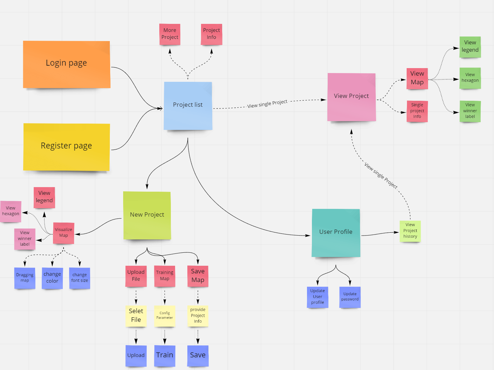
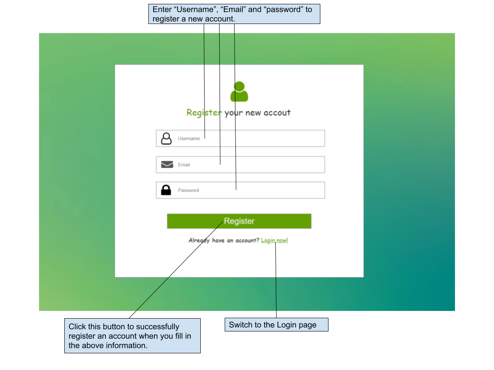
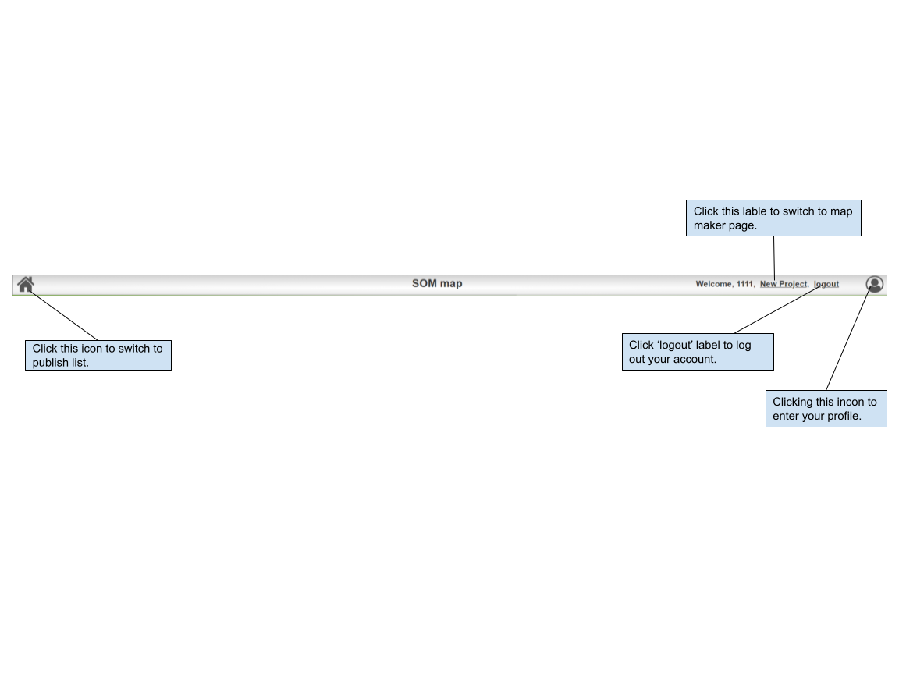
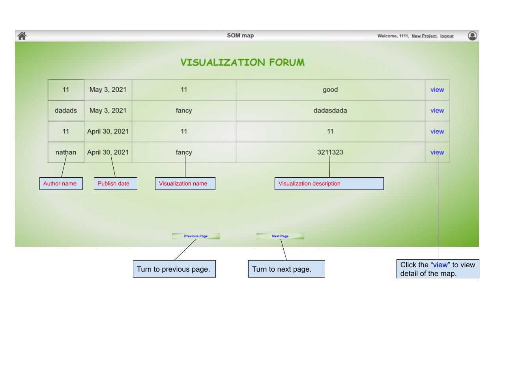
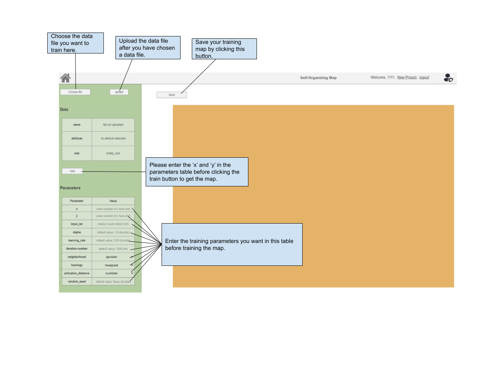
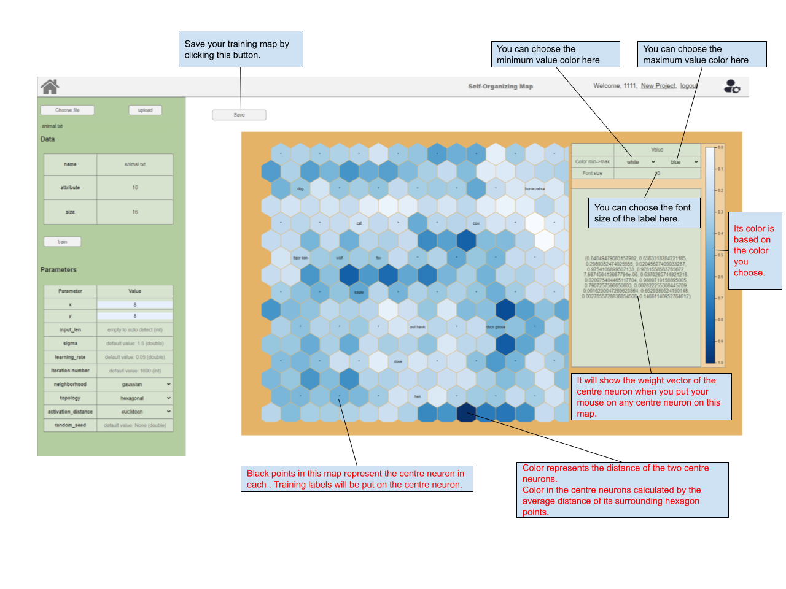
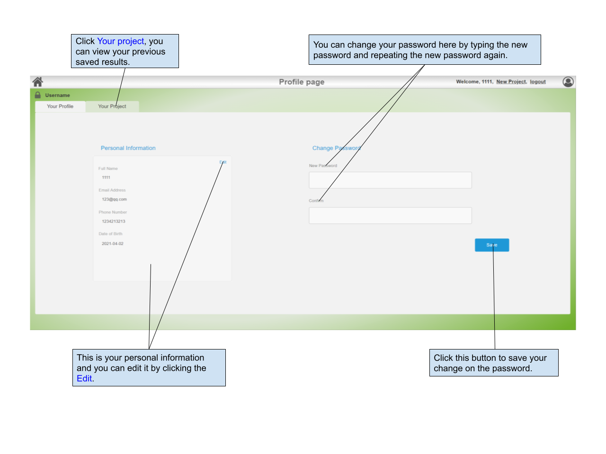
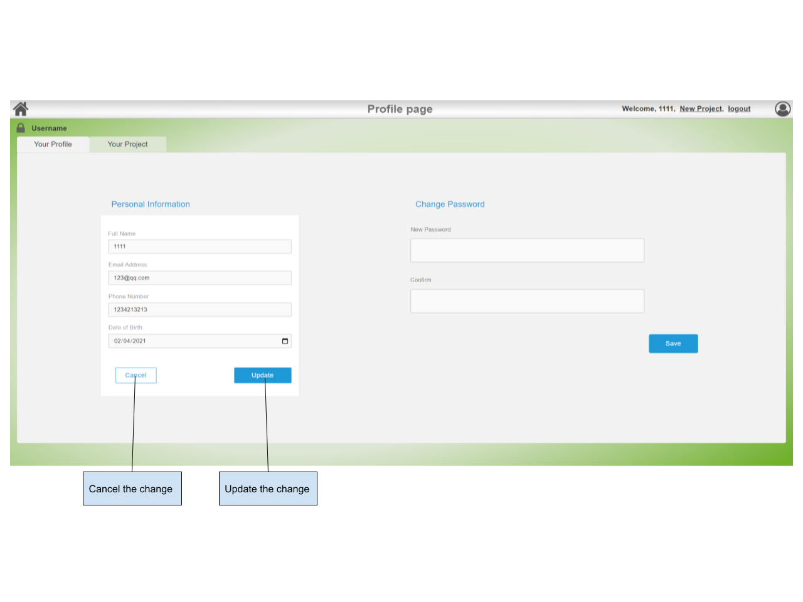
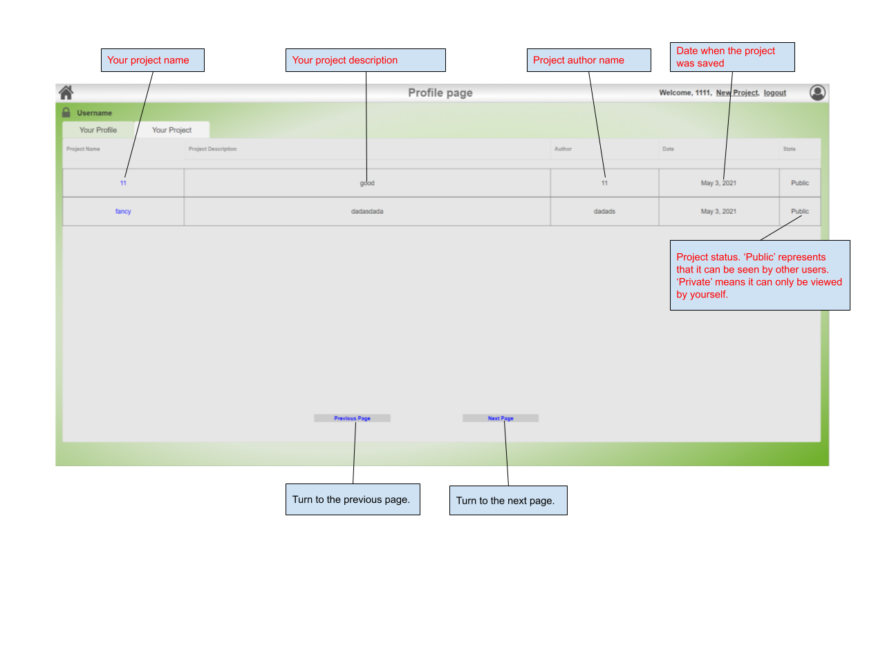
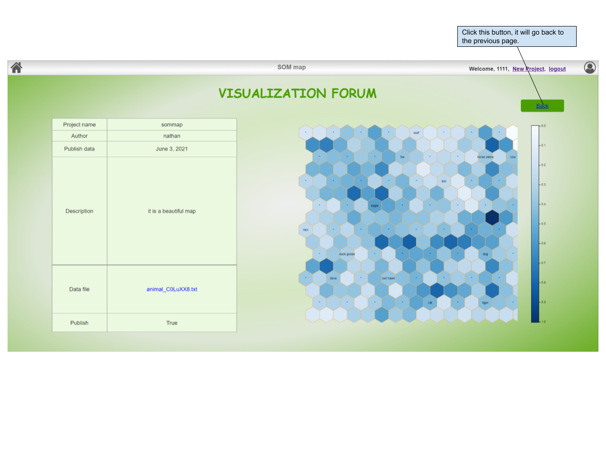

# Product Document

## Product overview

Our product is a database system that interacted with website surface. It can train the SOM self-Organizing map. It has user profile system. It has forum that can publish the user's map. 

## Product Navigation

The product navigation include pages and each page indicates its function under the page. The function include simple navigation by following steps.

## User manual

The following graphs describe the how to use this product.

_The explanation in the following graphs by black color describes the functions that can be interacted with you.The explanation in the following graphs by red color describes the elements that can not be interacted with you._

### Login your account

Login to your account. If you do not have an account, please switch to the Register page.

### Register your account

Please register before you Login.

### Navigation Bar

Interaction with Navigation bar can switch to other pages.

### Publish List

After you login into the system, you will see the publish list. You can view your and other user's published project here.

### New Project

Click on "New project" on any web page with a navigation bar, you can get access to this map maker page.

### User profile

Click on the "people" icon in the upper left corner of any web page with a navigation bar,  you can get access to this user profile page. You can edit the personal information or change your account password here. 

After clicking the **edit** in the Personal information table

### Saved Project History

After clicking **Your project,** you can view your previous saved project results.

### View the map

Click on the project name on publish or user profile website, you can get access to this page.

## User Story

## Function module

| Website name | Function |
| :--- | :--- |
| **User login** | **Allow user to enter the system for activities** |
| **User logout** | **Allow users to exit the system activity** |
| **User profile** | **Allows users to view or edit personal information** |
| **Password change** | **Allow users to change the new password for the account** |
| **Self-organizing map train** | **Allow users to upload local files to train self-organizing maps** |
| **Results save** | **Allow users to save visualization results after training** |
| **Results publish** | **Allow users to save and publish visualization results after training** |
| **Forum** | **Allow users to view other user’s projects\(visualization results\)** |

