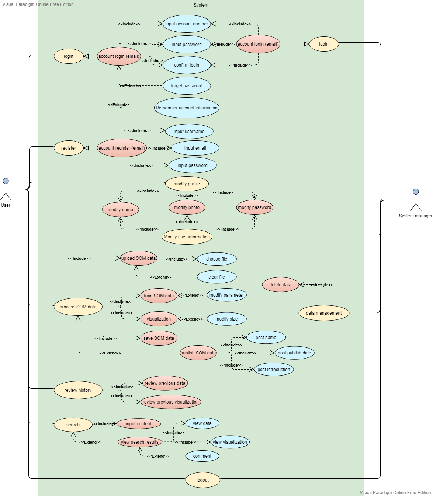

# Product document

## User Manual

### Product overview

Following graphs describe the overview of the product by pages.

The explanation in the following graphs by **black color** describes the functions that can be interacted with you.

The explanation in the following graphs by **red color** describes the elements that can not be interacted with you.

#### 

#### Login your account

Login in your account. If you do not have an account, please switch to the Register page.

#### Register your account

Please register before you login.

#### Navigation Bar

Interaction with Navigation bar can switch to other pages.

#### Publish List

After you login in the system, you will see the publish. You can view you and other user's published project here.

#### Map Maker 

Click on "New project" on any web page with a navigation bar, you can get access to this map maker page.

#### User profile

Click on "people" icon in the upper left corner of any web page with a navigation bar,  you can get access to this user profile page. You can edit the personal information or change your account password here. 

After clicking the **edit** in the Personal information table

### View your saved project

After clicking **Your project,** you can view your previous saved project results.

#### View the map

Click on project name on publish or user profile website, you can get access to this page.

## User case

## Function module

| Website name | Function |
| :--- | :--- |
| **User login** | **Allow user to enter the system for activities** |
| **User logout** | **Allow users to exit the system activity** |
| **User profile** | **Allows users to view or edit personal information** |
| **Password change** | **Allow users to change new password for the account** |
| **Self-organizing map train** | **Allow users to upload local files to train self- organizing maps** |
| **Results save** | **Allow users to save visualization results after training** |
| **Results publish** | **Allow users to save and publish visualization results after training** |
| **Forum** | **Allow users to view other user’s projects\(visualization results\)** |

