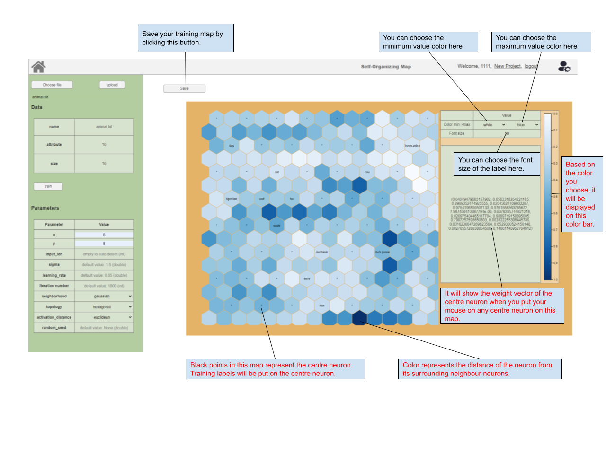

# User Manual

### Quick start with Login

Login in your account. If you don not have account, please switch to the Register page:

Register a new account in this page.

After you successfully login your account, you will see the publish website. It display the general information of Som-map project published by all users.

### Navigation Bar

### Publish list

### 

### Map maker 

